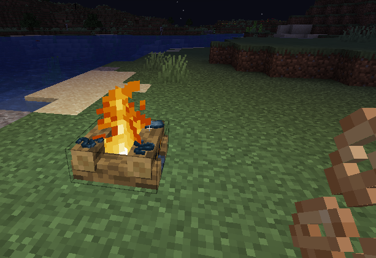

# Calamari
*A small mod that adds edible squid drop items.*

[**Modrinth**](https://modrinth.com/mod/calamari) | [**Github**](https://github.com/woodalis/calamari)

When killed, **squids** and **glow squids** drop 0 to 2 raw fillets and 0 to 4 raw tentacles.
Both of these [can be cooked](doc/recipes.png), into calamari and crispy tentacles respectively.

 - A **Raw Squid Fillet** restores 2 hunger and has a nourishment value of 0.2
 - **Calamari** restores 5 hunger and has a nourishment value of 1.2
 - A **Raw Squid Tentacle** restores 1 hunger and has a nourishment value of 0.2
 - A **Crispy Squid Tentacle** restores 3 hunger and has a nourishment value of 1.2

